# Template Types

# 1. Writing

Allow students to trace different letters. We can also add sound to 'pronounce'
the letter.

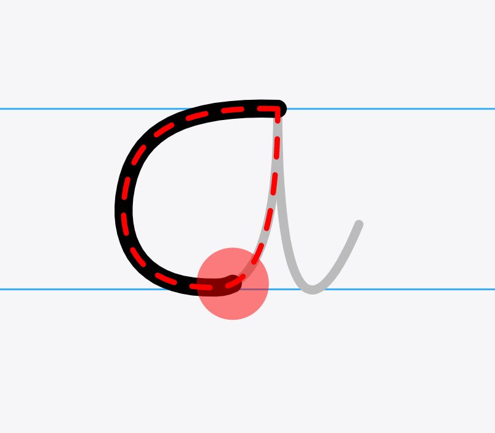

# 2. Sequence

Connect letters to form a word. Also connect words to form a sentence.

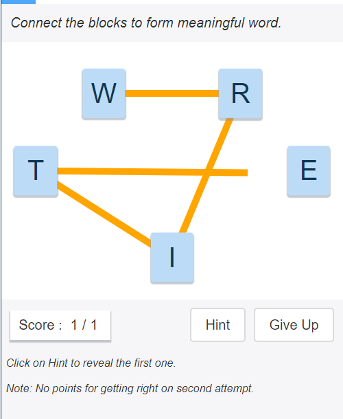

# 3. Complete Word

We have stack images.
([www.pschool.in/author/images](https://pschool.in/author/images)). Allow
students to write one or more missing letters. We can have an input component
(like shown in image) or a set of options to pick from.

Instead of image, we can also give a clue as text. (something like a crossword
clue)

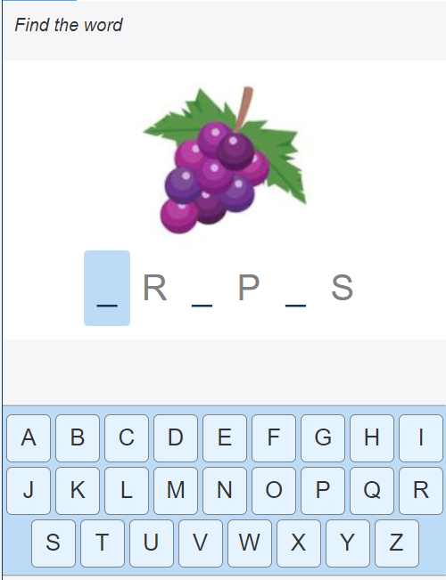

# 4. Connect Letters

It is just a variation of the above activity. Giving options may be easy to
guess. The input component may be hard for a kid to type. In such case, the kid
has to connect letters from left to write as shown in the image.

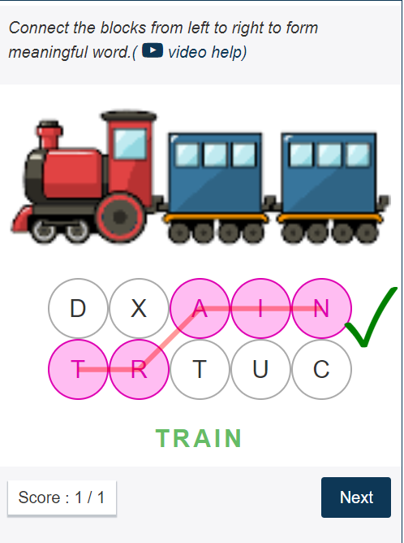

# 5. Right Match

This is a very simple activity where the student has to drag and match the right
option. Can be used for compound words, prefix, suffix, antonyms, synonyms

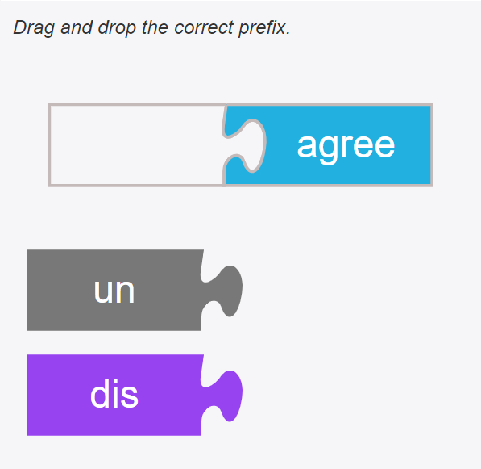

# 6. MCQ

Common Multiple Choice Questions (MCQ)

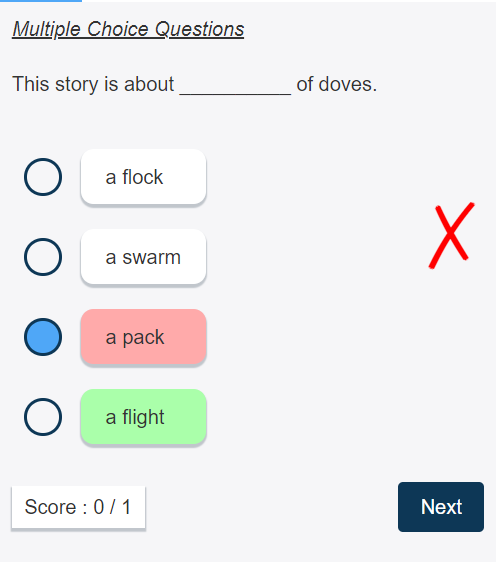

# 7. Right Option

Very similar to MCQ, but their is no separate question, only instruction. Find
the word with right/wrong spelling. Find the word that doesn't rhyme.

This activity is also used to 'pick the word based on audio'.

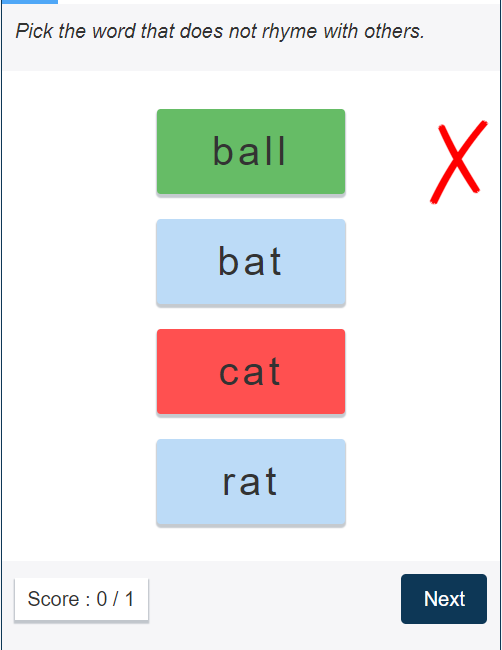

# 8. Match

The regular match the following. We can have stack images as options.

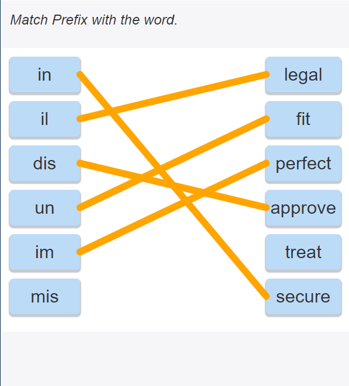

# 9. Passage

Can be used to have story, passage, poem (with images).

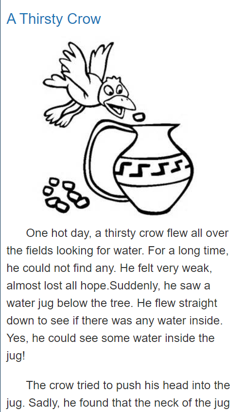

# 10. Fill Up

We classify fillup into three types.

1. The whole set of fillups will have same options. (Eg Fill in the blanks with
   articles. Here the options are fixed for all blanks (a, an, the))
2. Each blank will have different set of options.
3. No options. The student has to input letter by letter using the input
   component.

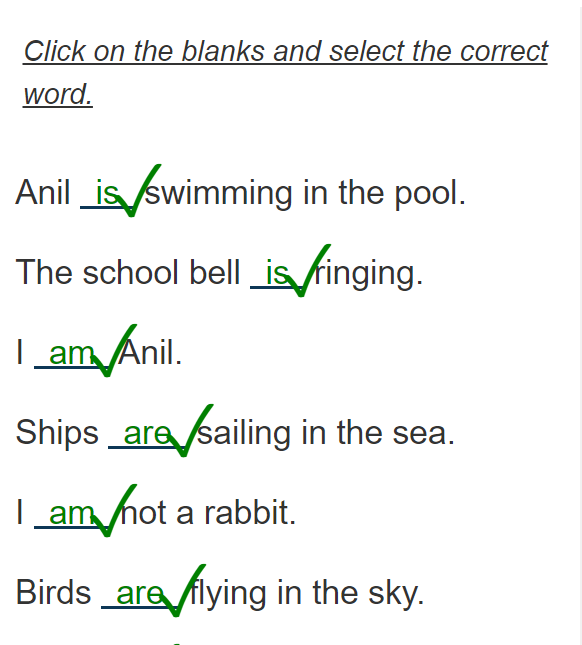

# 11. Fill Up by Drag & Drop

Drag and drop the words given at the bottom and fill it at the appropriate
place.

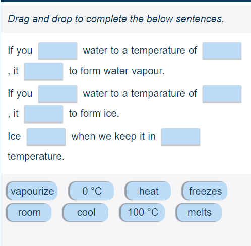

# 12. Drag and Drop on Images

This is drag and drop on images. Like parts of body, face, plants etc

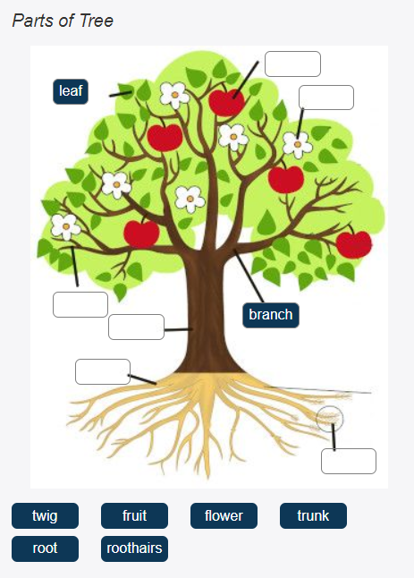

# 13. Classify Sentence

Classify a sentence. eg True or False, Past vs Present vs Future, Fact vs
Opinion

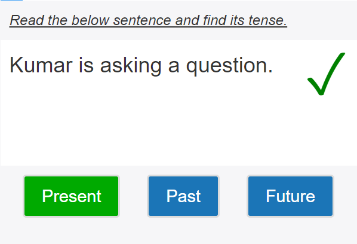

# 14. Classify words into two groups

Drag and drop the given words into the two boxes. eg fruits vs vegetables, noun
vs verb

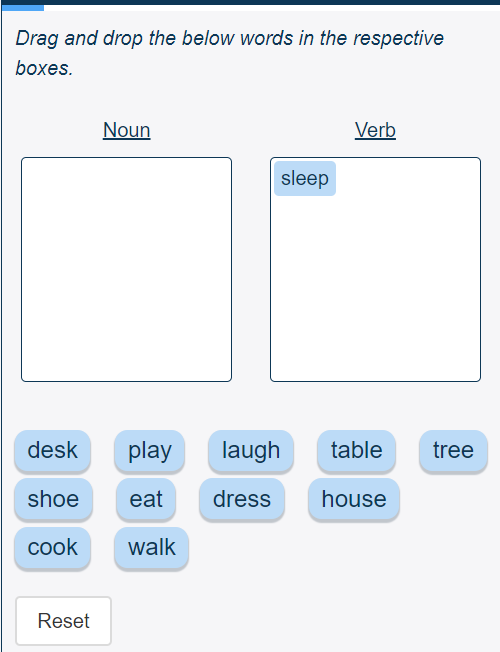

# 15. Select Word

Select a word from the sentence or a set of sentences. eg. select the verb,
select the word with spelling mistake

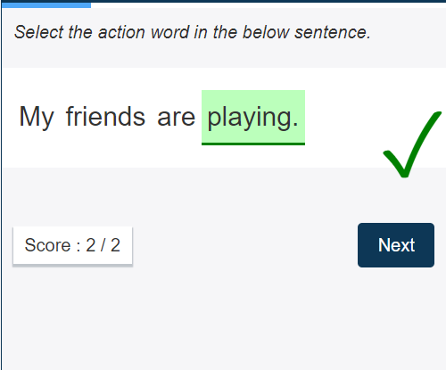

# 16. Sorting

Rearrange the items in a particular order. Eg: Rearrange the number in
ascending/descending order.

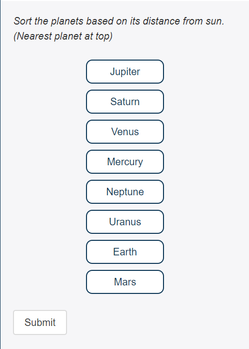

# 17. Word Search

Find words from a table of characters.

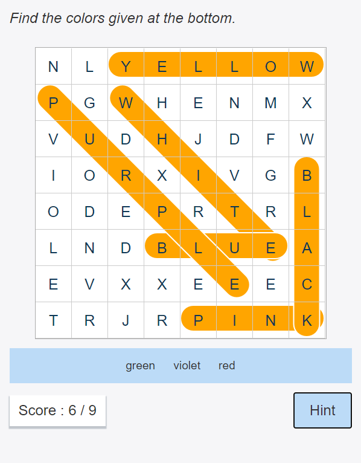

# 18. Crossword

Classic crossword.

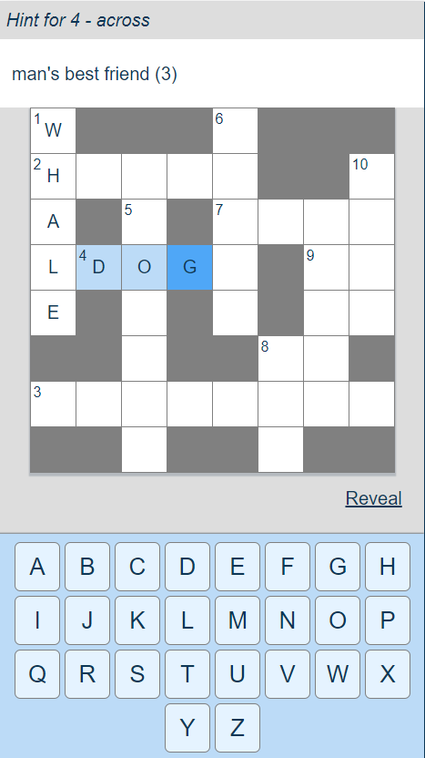
